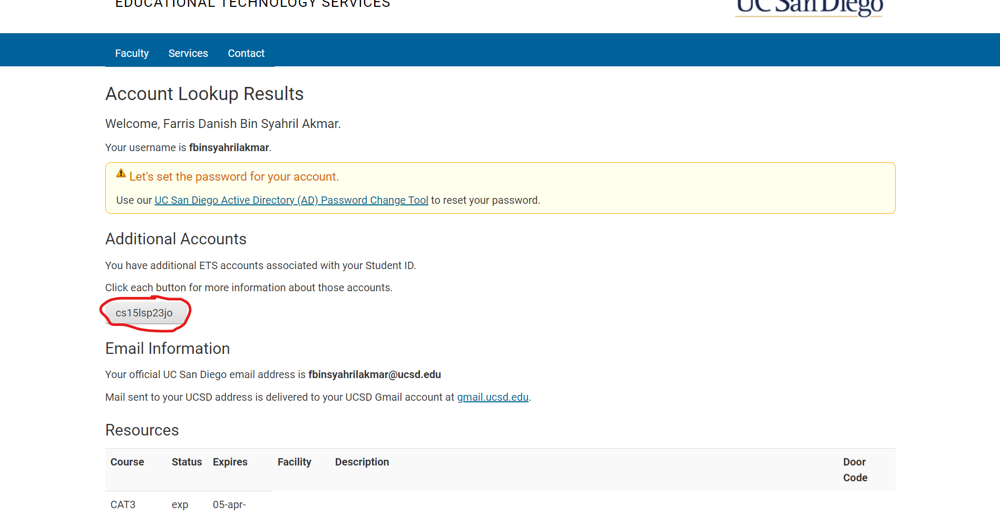

Remote into ieng6
===

Install Visual Studio Code
--
Go to [code.visualstudio.com](code.visualstudio.com) and install VScode. You can skip this step if you already have it installed.
You should have VScode open.

Remotely connect to ieng6
--
Find your username [here](https://sdacs.ucsd.edu/~icc/index.php). Type in your username and PID.

Change the password to **the cs15l username** to something that is easy to remember.

Run git bash on VScode and type `ssh cs15lsp23jo@ieng6.ucsd.edu`. Change *jo* to your specific username. Mine happened to be jo.
Type in the password to the username (the one you just changed to). You should be connected after this.

Try some commands
--
You can try some bash commands like:
* `pwd`
* `ls`
* `cd`

You should see something like this:

