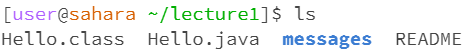
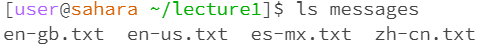
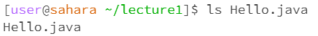
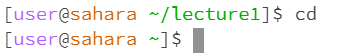
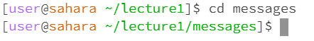
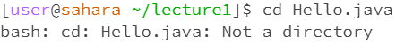
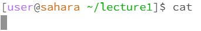
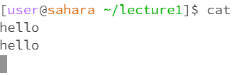
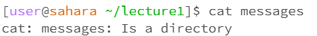
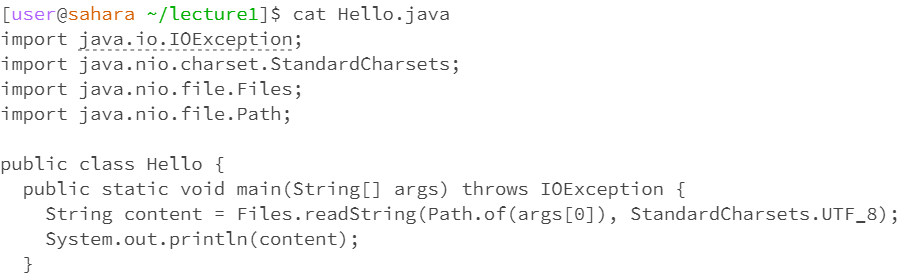

Basic filesystem commands
==

Three basic commands:
--
1. `ls`
2. `cd`
3. `cat`

`ls`
--
1. with no arguments  
   `ls`  
     
   The command was ran in the lecture1 directory. Since there was no arguments specified (i.e. no other keywords following `ls`), `ls` just shows the children         files and folders in the directory.
2. with a path to a directory as an argument  
   `ls messages`  
     
   The command was ran in the lecture1 directory. Since argument `messages` was specified after the `ls` keyword, it will output all the children paths in the         messages directory.
3. with a path to a file as an argument  
   `ls Hello.java`  
     
   The command was ran in the lecture1 directory. Since the argument was the name of a file (i.e. there a `.java` extension), it will just output the name of the      file.

`cd`
--
1. with no arguments  
   `cd`  
     
   The command was ran in the lecture1 directory. Since we are not in the root directory, `cd` brings us to the root directory.
2. with a path to a directory as an argument  
   `cd messages`  
     
   The command was ran in the lecture1 directory. Since the specified path is in the lecture1 directory, the command changes the directory to the one specified.
3. with a path to a file as an argument  
   `cd Hello.java`  
     
   The command was ran in the lecture1 directory. Since `Hello.java` is not a directory, an error will occur.

`cat`
--
1. with no arguments  
   `cat`  
     
   The command was ran in the lecture1 directory. Since there were no arguments specified after the command, `cat` will wait for user input and just echo back         whatever we type in the terminal and will exit with keyboard interrupt `CTRL + C`/`CMD + C`.  
   
2. with a path to a directory as an argument  
   `cat messages`  
     
   The command was ran in the lecture1 directory. Since the argument is a directory, an error will occur.
3. with a path to a file as an argument  
   `cat Hello.java`
     
   The command was ran in the lecture1 directory. Since the argument was a `.java` file, the terminal will first try to run the java file then print the code in       the `.java` file.
