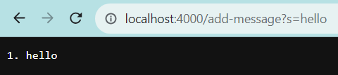
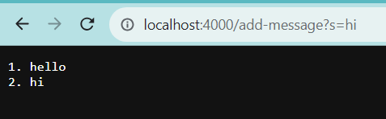

# 1. **String Server**
Code:
```
import java.io.IOException;
import java.net.URI;
import java.util.ArrayList;

class Handler implements URLHandler {

  // The one bit of state on the server: a number that will be manipulated by
  // various requests.
  ArrayList<String> items = new ArrayList<String>();

  public String handleRequest(URI url) {
    String item_list = "";
    if (url.getPath().equals("/")) {
      for (String string : items) {
        item_list += " " + string;
      }
      return item_list;
    } else {
      if (url.getPath().contains("/add")) {
        String[] parameters = url.getQuery().split("=");
        if (parameters[0].equals("s")) {
          items.add(parameters[1]);
          return String.format("Item %s added!", parameters[1]);
        }
      }

      if (url.getPath().contains("/search")) {
        String[] parameters = url.getQuery().split("=");
        if (parameters[0].equals("s")) {
          String result = "";
          for (String string : items) {
            if (string.contains(parameters[1])) {
              result += " " + string;
            }
          }
          return result;
        }
      }
      return "404 not found";
    }
  }
}

class SearchEngine {

  public static void main(String[] args) throws IOException {
    if (args.length == 0) {
      System.out.println(
        "Missing port number! Try any number between 1024 to 49151"
      );
      return;
    }

    int port = Integer.parseInt(args[0]);

    Server.start(port, new Handler());
  }
}

```
<br>
1. The methods called are `handleRequest`, `contains`, `getPath`, `getQuery`,
`split`, `equals`, `add` and `format`.
2. The relevant arguments are `url`, `items`, `item_list`, `parameters`, . Their respective
values are `new URI ("http://localhost:4000")` for `url`, an empty string arraylist
to add our items in, a formatted list as a string to return to print on the
browser, a string array with the path of the server.
3. The value of `url` doesn't change. The value of `items` changes as we add the
element `"hello"`. `item_list` changes to `"1. hello"`. `parameters` changes to
`["s", "hello"]`.

<br>
1. The methods called are `handleRequest`, `contains`, `getPath`, `getQuery`,
`split`, `equals`, `add` and `format`.
2. The relevant arguments are `url`, `items`, `item_list`, `parameters`, . Their respective
values are `new URI ("http://localhost:4000")` for `url`, an empty string arraylist
to add our items in, a formatted list as a string to return to print on the
browser, a string array with the path of the server.
3. The value of `url` doesn't change. The value of `items` changes as we add the
element `"hi"` to become `["hello", "hi"]`. `item_list` changes to `"1. hello 2. hi"`. `parameters` changes to `["s", "hi"]`.

# 2. **SSH keys**
**Private key on local machine:**<br>
<br>
**Public key on ieng6 server:**<br>
<br>
**Login without password:**<br>


# 3. **Something new**
In lab 2 and 3, I learned how to remote into a machine. This is useful as a
software engineer as I can leave my main machine at home and just work on
a laptop to write and read code. I also learned the basics of a server. This is
useful to make a local prototype of a web app to see if everything works
correctly.