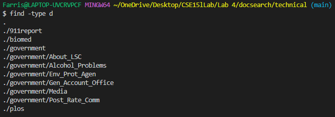

# Bugs

We'll go through the file `LinkedListExamples.java` to search for bugs in
methods<br>

## Non-failure inducing input

```
import static org.junit.Assert.*;

import org.junit.*;

public class LinkedListTests {

  private LinkedList emptyList;

  \\ Runs before each tests.
  @Before
  public void initialize() {
    emptyList = new LinkedList();
  }

  \\ Aims to test append(int value) with calling it once.
  @Test
  public void testAppendOnce() {
    emptyList.append(1);
    assertEquals(1, emptyList.root.value);
  }
}
```

This is the code we use to run our Junit tests. The `@Before` tag makes sure
that any of the code that follows it run before each tests.<br>
Here we are testing the method `append` in the `LinkedList` class. The method
should put whatever value we pass into the parameter as the root node of the
list. We call the method once and use `assertEquals` to check whether we get our
expected value of 1 as the value in our root node. Note that we refrain from
using any helper methods provided in the `LinkedList` class such as the `first`
method and instead use the field variable `emptyList.root.value` as the `first`
method may also contain bugs.<br>
This test runs perfectly.

## Failure-inducing input

```
public class LinkedListTests {

  private LinkedList emptyList;

  \\ Runs before each tests.
  @Before
  public void initialize() {
    emptyList = new LinkedList();
  }

  \\ Aims to test append(int value) with calling it once.
  @Test
  public void testAppendOnce() {
    emptyList.append(1);
    assertEquals(1, emptyList.root.value);
  }

  \\ Aims to test append(int value) with calling it multiple times.
  @Test
  public void testAppendMultipleTimes() {
    for (int i = 0; i < 3; i++) {
      emptyList.append(i);
    }
    assertEquals(0, emptyList.root.value);
    assertEquals(1, emptyList.root.next.value);
    assertEquals(2, emptyList.root.next.next.value);
  }
}
```

We added some lines of code containing a new test to test the same method. In
this test we check to see if the method can append multiple times. We use a for
loop to call the method 3 times and check each value to see if it matches what
we expect. We expect to see the nodes to have values 0, 1, 2, in that order.
Note we still use field variables instead of helper methods.<br>
This test would not stop running, hinting at an infinite loop somewhere in the
code.
<br>
The error is in line 43 of the code
```
    // Otherwise, loop until the end and add at the end with a null
    while(n.next != null) {
        n = n.next;
        n.next = new Node(value, null);
    }
```
The while loop will not terminate. The condition for the for loop to terminate
is when `n.next` is null but we keep setting `n.next` to our value given in the
parameter in the loop. To fix this we simply move the line outside of the loop.
```
    // Otherwise, loop until the end and add at the end with a null
    while(n.next != null) {
        n = n.next;
    }
    n.next = new Node(value, null);
```
Now running the test results in a pass.<br>


# `Find` command-line options

1. `-type`<br>
This option let's you choose whether you are searching for files or directory.
For example, you can display all the directories under your working directory
using `find -type d`. Or you can find only the files inside the working
directory using `find -type f`. The `find` command searches recursively.
<br>
`find -type d`<br>
<br>
`find -type f`

2. `-iname` \ `-name`<br>
This option lets you find the file / directory with the given name. You can also
use this to find file extensions using `find -name "*.txt"` to find all .txt
files for example. The `-iname` option lets you do partial and case-insensitive
searches.
<br>
`find -iname "*legal*"`<br>
<br>
`find -name "*.txt"`

3. `-exec`<br>
This option lets you use commands on the output of the `find` command.
For example, you can do `find -iname "*legal*" -exec grep city {} \;` to find
lines with the word **"city"** in files that has **"legal"** in its name. 
<br>
This can also be useful to copy files.

<br>
Alternatively, we can use `| xargs` which does the same thing but faster.


4. `-mindepth` \ `-maxdepth`<br>
This option is useful to navigate through directories without cluttering your
screen.


### Sources
https://www.redhat.com/sysadmin/linux-find-command<br>
https://www.baeldung.com/linux/find-command