# Vim
1. First, starting from the terminal, ssh into the server with "`ssh cs15fakx@ieng6.ucsd.edu`". You shouldn't have to enter a password. 
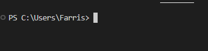 
 
2. Then check if you already have a `lab7` directory with the command "`ls`" and if you do have it, delete it with the command `rm -r -f lab7`. 
 
 
3. Go to the github page. Under the clone button, select the option `SSH` and
copy the link.
 
4. In the terminal, clone the repository by typing "`git clone <link>`", where
`<link>` is the link you copied from the repository. You should have the
repository `lab7` when you type in the command "`ls`"
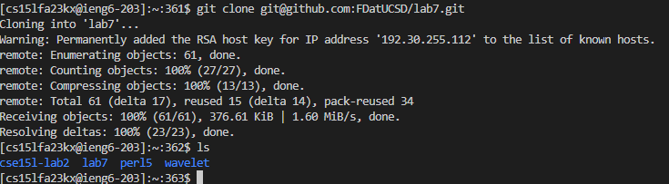 
5. Change directories to the newly cloned `lab7` by typing the command "`cd lab7`".
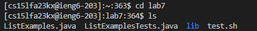 
6. Run the unit tests using the prepared script by typing the command "`bash test.sh`".
You should see the tests fail. We need to fix the bugs. From the test, we know
that the error occured at line 44 in the file `ListExamples`.
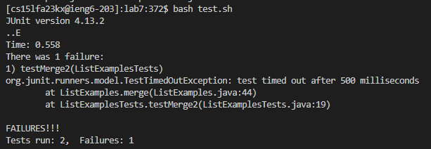 
7. Edit the file using vim by typing in the command "`vim FileExamples.java`".
You should see the contents of the file in the terminal.
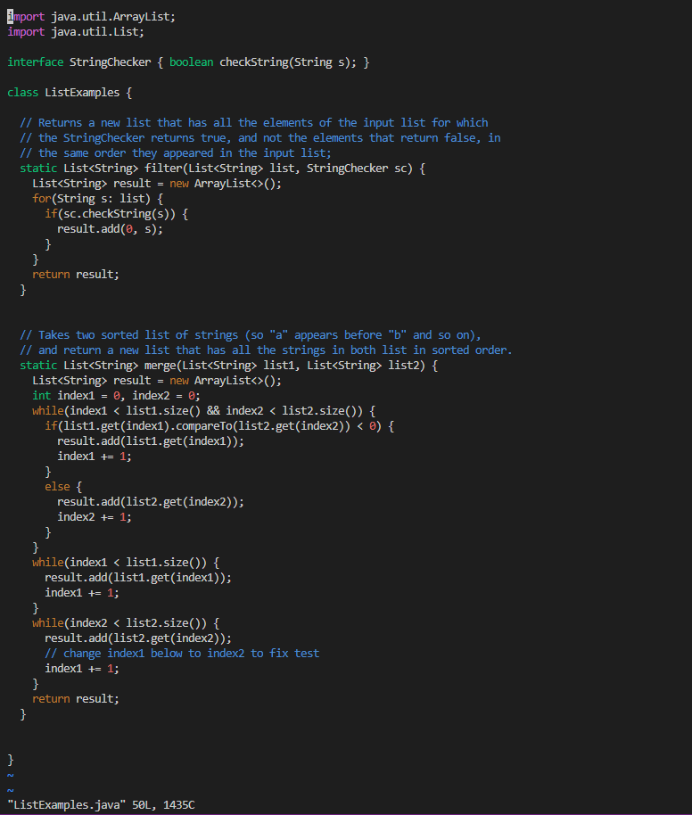 
8. We know that the error is on line 44 so we can skip to line 44 by using
`<shift>G44`.
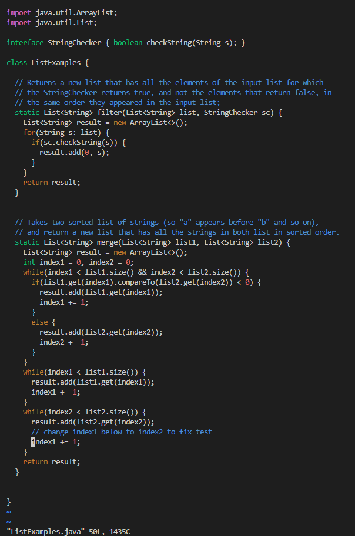 
9. We can increment 1 to 2 from `"index1"` to `"index2"` by using `<ctrl>a`.
Next, we can save the file using `:wq! ListExamples.java`. You can also save
without providing the file name using `:wq!`. 
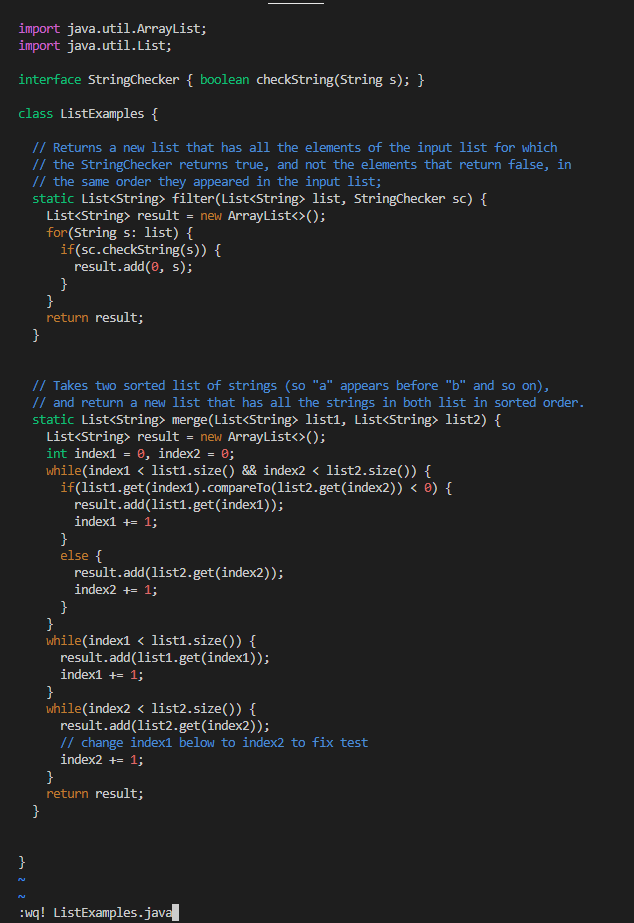 
10. We can rerun the test to see if we fixed the bugs by typing "`bash test.sh`" 
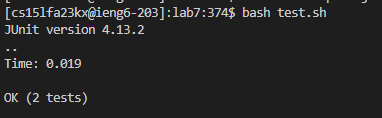 
11. Then we can commit changes to github. First, we need to add our file by
using the command "`git add ListExamples.java`". Then commit our changes using
the command "`git commit`". Add your commit message by pressing `i` on the
keyboard then typing your message and save your commit message by pressing `:wq`.  
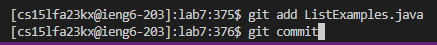 
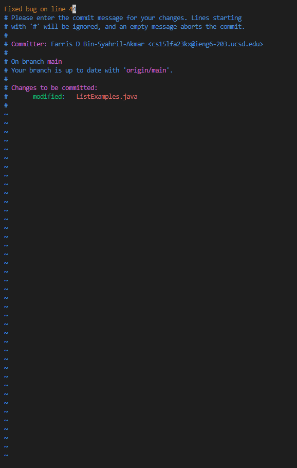 
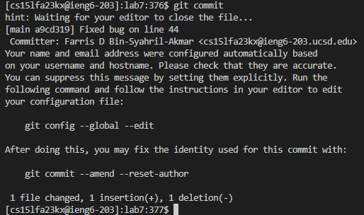 
13. Then, finally push your changes using "`git push`"
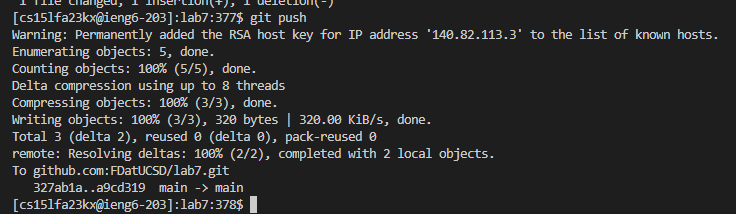 