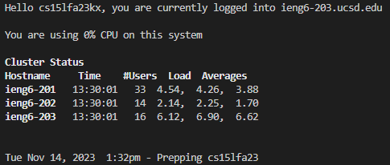
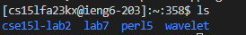
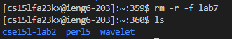
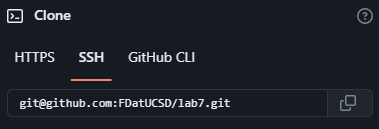

# Command Line
1. Setup Delete any existing forks of the repository you have on your account
2. Setup Fork the repository
3. The real deal Start the timer!
4. Log into ieng6  
Starting from a clean powershell terminal we can type `ssh cs15lfa__@ieng6.ucsd.edu`
to ssh into the server without having to type in any passwords.

5. Clone your fork of the repository from your Github account (using the SSH URL)  
First check if there is already a lab7 folder using the command `ls`
 
If you do have a lab7 folder already, remove it using the command `rm -r -f lab7` 
 
Get the link to clone your repository by going on github, and click clone in the repository
that you want to clone. Get the link under the `SSH` tab.
 
6. Run the tests, demonstrating that they fail
7. Edit the code file to fix the failing test
8. Run the tests, demonstrating that they now succeed
9. Commit and push the resulting change to your Github account (you can pick any commit message!)