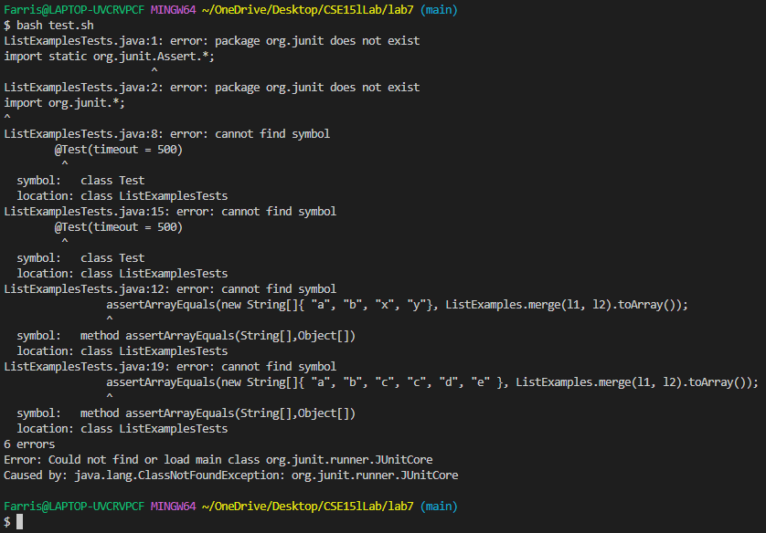
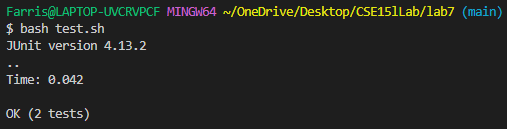
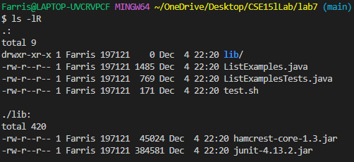

# Debugging scenario
1. Student post


*I keep getting this error saying the JUnit library does not exist when trying
to run the test script. I tried replacing my lib directory but it still doesn't
work.*<br>

2. TA response

*When cloning from the repo, the test.sh file might have been made on a
different operating system than the one you are using. Make sure that the
test.sh file uses the correct syntax for you operating system. For mac:*
```
javac -cp ".:lib/hamcrest-core-1.3.jar:lib/junit-4.13.2.jar" *.java
java -cp ".:lib/junit-4.13.2.jar:lib/hamcrest-core-1.3.jar" org.junit.runner.JUnitCore ListExamplesTests
```
*For windows:*
```
javac -cp ".;lib/hamcrest-core-1.3.jar;lib/junit-4.13.2.jar" *.java
java -cp ".;lib/junit-4.13.2.jar;lib/hamcrest-core-1.3.jar" org.junit.runner.JUnitCore ListExamplesTests
```
*Notice that the file path for mac uses `:` and windows uses `;`.*

3. Fix

<br>
The bug was the test.sh file was written for mac os while the user was trying to
run it on windows resulting the shell not recognizing the filepath that results
in java not finding the methods used for JUnit tests.

4. Details

File structure:<br>
<br>

### Files before
ListExamples.java:<br>
```
import java.util.ArrayList;
import java.util.List;

interface StringChecker { boolean checkString(String s); }

class ListExamples {

  // Returns a new list that has all the elements of the input list for which
  // the StringChecker returns true, and not the elements that return false, in
  // the same order they appeared in the input list;
  static List<String> filter(List<String> list, StringChecker sc) {
    List<String> result = new ArrayList<>();
    for(String s: list) {
      if(sc.checkString(s)) {
        result.add(0, s);
      }
    }
    return result;
  }


  // Takes two sorted list of strings (so "a" appears before "b" and so on),
  // and return a new list that has all the strings in both list in sorted order.
  static List<String> merge(List<String> list1, List<String> list2) {
    List<String> result = new ArrayList<>();
    int index1 = 0, index2 = 0;
    while(index1 < list1.size() && index2 < list2.size()) {
      if(list1.get(index1).compareTo(list2.get(index2)) < 0) {
        result.add(list1.get(index1));
        index1 += 1;
      }
      else {
        result.add(list2.get(index2));
        index2 += 1;
      }
    }
    while(index1 < list1.size()) {
      result.add(list1.get(index1));
      index1 += 1;
    }
    while(index2 < list2.size()) {
      result.add(list2.get(index2));
      // change index1 below to index2 to fix test
      index2 += 1;
    }
    return result;
  }


}
```
ListExamplesTest.java:<br>
```
import static org.junit.Assert.*;
import org.junit.*;
import java.util.*;
import java.util.ArrayList;


public class ListExamplesTests {
        @Test(timeout = 500)
        public void testMerge1() {
                List<String> l1 = new ArrayList<String>(Arrays.asList("x", "y"));
                List<String> l2 = new ArrayList<String>(Arrays.asList("a", "b"));
                assertArrayEquals(new String[]{ "a", "b", "x", "y"}, ListExamples.merge(l1, l2).toArray());
        }

        @Test(timeout = 500)
        public void testMerge2() {
                List<String> l1 = new ArrayList<String>(Arrays.asList("a", "b", "c"));
                List<String> l2 = new ArrayList<String>(Arrays.asList("c", "d", "e"));
                assertArrayEquals(new String[]{ "a", "b", "c", "c", "d", "e" }, ListExamples.merge(l1, l2).toArray());
        }

}
```
test.sh:<br>
```
javac -cp .:lib/hamcrest-core-1.3.jar:lib/junit-4.13.2.jar *.java
java -cp .:lib/hamcrest-core-1.3.jar:lib/junit-4.13.2.jar org.junit.runner.JUnitCore ListExamplesTests
```

### Files after
test.sh:<br>
```
javac -cp .;lib/hamcrest-core-1.3.jar;lib/junit-4.13.2.jar *.java
java -cp .;lib/hamcrest-core-1.3.jar;lib/junit-4.13.2.jar org.junit.runner.JUnitCore ListExamplesTests
```
Every other file is the same.

# Reflection
The coolest and most useful thing I've learned is using regular expressions. You
can match regex and do stuff to the captured group. 
1. You can find and replace words in vim. One scenario to use this is to convert
a test.sh written for mac to one written for windows. You can use `:%s/:/;/g`
to replace all `:` to `;`. The `%s` part lets you match across the whole file,
the characters inside the forward slashes are the characters to match and the
ones to replace with in the form `/<matches>/<replaces>/`. The last `g` at the
end is the global flag.
2. `grep -E` is pretty useful as it lets you use extended regex for more
complicated matches. Specifically, it allows you to use `+`, `|` and `?`. This
can be useful in the autograder script to check method headers. For example,
`'static List<String> filter\(List<String> list(,|, )StringChecker sc\)' student-submission/ListExamples.java` can be used to check whether the method header is as expected
when using an if statement. notice the usage of `(,|, )` to check for both cases
where you add a space after the comma and not. Useful flags here are `grep -qE`
where `-q` is the quiet flag so that the results won't be output to the terminal
when running the script. `grep -oE` is also useful. `-o` only outputs the
matched expression so `grep -oE '\d{3}-\d{3}-\d{4}' > phonenumbers.txt` would output all
occurrences of phone numbers in the form of 012-345-6789 in a file to another
file called phonenumbers.txt.